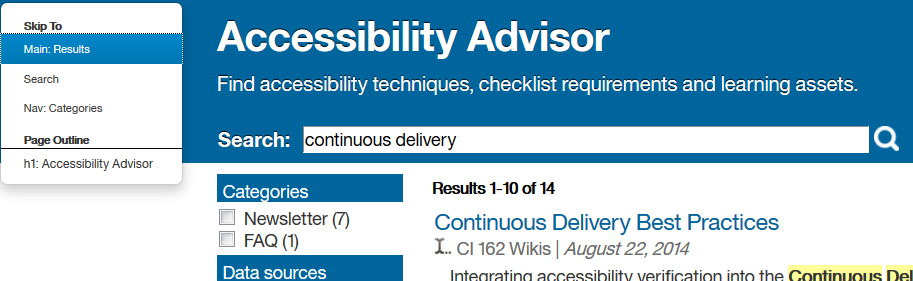

# accessNav version 1.2
## by IBM Accessibility 
Copyright (c) 2016, IBM Corporation. All rights reserved.

Copyright (c) 2014, eBay Software Foundation. All rights reserved. 

The accessNav script is based on the SkipTo version 2.1 script and is a replacement for the classic *Skipnav* link. It creates a drop-down menu that lists the links to the important places on the current web page. Once accessNav is installed and configured, its menu makes it easier for keyboard and screen reader users to quickly jump to a location by choosing the location from the menu.

 
## How it works
1.  By default the accessNav *Skip To* menu becomes visible the first time the user tabs into the page or may appear after the page is loaded if the visibility is set to onLoad.
2.  Once the keyboard focus is on the *Skip To* menu, selecting the **Enter** key or the **Spacebar** will display the list of high-level headings and landmarks on the current page.
3.  Use the arrow keys to select a choice; then select **Enter** to skip to it.
4.  To return to the *Skip To* menu, use the built-in access key (0 by default) which opens the menu and moves focus to it. Refer to the notes on [Access keys](#access-keys) for more information.

## <a name="enabling_javascript">Enabling the JavaScript on your web page</a>
All you need is either `SkipTo.js` or `SkipTo.min.js` from the `compiled/js` directory. Please note that `SkipTo.min.js` is a minified (light-weight) version of the script. (NOTE: UPDATE ALL FILENAMES WHEN MOE CHANGES IT TO ACCESSNAV)  If you would like to be able to debug your production-ready script, include the provided `SkipTo.min.map` file as well.

To use the accessNav script, just include it at the bottom of your HTML page or template as follows:

```html
<script type="text/javascript" src="../compiled/js/skipto.js"></script>
```

Note: Make sure that `src` points to the place where you put the Javascript file in your web application. Otherwise, things will not work directly. For detailed instructions on how to deploy the script to an IBM Connections environment, refer to [Deploying to IBM Connections.](#connections)

## <a name="connections">Deploying to IBM Connections</a>

### Custom JavaScript
The following instructions outline how to deploy the accessNav script *Skip To* menu to an on-premise version of IBM Connections. These instructions were tested using IBM Connections Version 5.5.0. Full details of how to deploy custom JavaScript to IBM Connections are found in the IBM Knowledge Center topic, [Extending JavaScript in IBM Connections.](http://www.ibm.com/support/knowledgecenter/SSYGQH_5.5.0/admin/customize/t_customize_extend_js.html) 

IBM Connections uses the shared resources WAR file, `connections.web.resources.war,` to aggregate and serve all JavaScript files. This WAR file is based on the OSGi extension model, which allows new capabilities to be added to a system via a plug-in mechanism. IBM Connections leverages this mechanism to provide the following capabilities: 

*  Expose custom JavaScript 
*  Ensure that custom JavaScript loads when another module is loaded

To extend the JavaScript used in IBM Connections, first you must put your JavaScript files into an OSGi bundle (a JAR file with a special `MANIFEST.MF` file and some directories), and deploy the bundle into IBM Connections. Then, you need to link your JavaScript to ensure that it is loaded at the same time as the rest of the JavaScript in IBM Connections.

### Adding `Skipto.js` to a sample app
The easiest way to extend the JavaScript used in IBM Connections is to start with a sample bundle, add files to it, and deploy it in your IBM Connections environment. Complete the following steps to extend the JavaScript used in IBM Connections using a sample bundle.

1.  Download the following sample bundle: `com.mycompany.example_1.0.0.jar`
2.  Deploy and test the sample bundle. 
	*  Copy the sample bundle to web resources provisioning directory for IBM Connections. The installer creates this directory at the following location: `CONNECTIONS_HOME/data/shared/provision/webresources`
	*  Stop and start the Common Websphere Enterprise Application (common.ear) from the Websphere Application Server interface.
	*  Test the deployment of the sample app by opening the `readme.txt` file included with the sample bundle by entering the following URL in your web browser: 	`http://server/connections/resources/web/com.mycompany.example/readme.txt`
3.  Add `SkipTo.js` to the sample bundle.
	*  Using your favorite archive editor, add the `Skipto.js` to the `resources/directory` of the sample bundle:  `com.mycompany.example_1.0.0.jar.`
4.  Edit the `plugin.xml` file in the sample app and add a new `<dojoModuleBinding>` element following `demonstration.js` to request that `SkipTo.js` is loaded after core Connections JavaScript is loaded. 

	`<dojoModuleBinding bind="com.mycompany.example.demonstration" to="lconn.core.header" />`

	`<dojoModuleBinding bind="com.mycompany.example.skipto" to="lconn.core.header" />`
5.	Restart common.ear to pick up the changes in the `plugin.xml` file.
 	* Stop and start the Common Websphere Enterprise Application (common.ear) from the Websphere Application Server interface. 
6.	Clear your browser cache and verify `skipto.js` is discoverable by viewing it on your server. For example, enter the following url into your browser: 

	`http://server/connections/resources/web/com.mycompany.example/skipto.js`
	
7.	Optionally, change the name of the bundle. Refer to the IBM Knowledge Center topic, [Extending JavaScript in IBM Connections.](http://www.ibm.com/support/knowledgecenter/SSYGQH_5.5.0/admin/customize/t_customize_extend_js.html) 
8.	Log in as a user to test the accessNav *Skip To* script. For example, open the Blogs application and type Alt + Shift + 0 keys to launch the accessNav *Skip To* menu when accessing the application in Firefox. 
	
	Note: The access key is customizable and varies per browser. In Internet Explorer, Alt + 0 is the default access key.

## Configuring accessNav options
By default, the accessNav *Skip To* menu includes the following places on the page:

*  Heading (e.g., h1, h2, h3 and h4 elements).
*  ARIA landmarks (e.g., banner, navigation, main and search).
*  HTML5 Section Elements (e.g., main, `section[aria-label],` `section[aria-labelledby]`)
*  Any element with the id specified via the configuration file.
*  Any element with the custom class specified via the configuration file.

and options:

*  The "accesskey" is set to 0.
*  The menu is set not to wrap.
*  The menu is visible on keyboard focus only (can be changed to be always visible via the "onload" parameter).

You may have different requirements for your web site and can include other heading levels, other ARIA landmarks, and HTML5 sectioning elements. You will need to provide a JSON object containing the necessary configuration parameters. This may look like the following:

```html
<script>
var SkipToConfig =
{
	"settings": {
		"skipTo": {
			"headings"     : "h1, h2, h3, h4",
			"main"         : "main, [role=main]",
			"landmarks"    : "[role=navigation], [role=search]",
			"sections"     : "nav",
			"ids"          : "#SkipToA1, #SkipToA2",
			"customClass"  : "MyClass",
			"accesskey"    : "0",
			"wrap"         : "true",
			"visibility"   : "onfocus",
			"attachElement": ".MyCustomClass" // or "attachElement": "#MyCustomId"
		}
	}
};
</script>
```

The code above will need to be inserted before including the `SkipTo.js` or `SkipTo.min.js` into your page or template.

### Notes
*  Most parameters are optional.
*  accessNav can be attached to any element on the page (refer to the "attachElement" parameter). If no "attachElement" is found, the script will be attached as the first element after the body.
*  When the custom class is specified (refer to the "customClass" parameter), the user can override the style, as in the following `MyCustomClass` CSS example:

```CSS
.dropMenu .MyCustomClass {
	background:  red;
	left: 50px;
	top: 50px;
}
```

## Compiling CSS and JavaScript
You may feel slightly adventurous and decide to change some colors or even enhance the script with your changes. Once you do this, here is how you compile the accessNav script for production.

1.  Get [NodeJS](http://nodejs.org) and install it on the operating system of your choice.
2.  Get [the latest code from Github](https://github.com/paypal/skipto).
3.  After unzipping or downloading the source code into the directory of your choice, switch to that directory and type these commands:

  ```sh
   sudo npm install grunt-cli -g
   npm install  
   grunt
  ```
4.  You should now have a directory called `**compiled**` with the necessary files in it.
5.  Refer to the instructions in [Enabling the JavaScript on your web page](#enabling_javascript) for information on which files you need to get the accessNav script running on your web page.

Note: On Windows, `build-win.bat` runs `npm install` and `grunt` modules (Step 3). To successfully run, you must launch a Windows command prompt as an Admin (Ctrl + Shift + Enter) and then run `build-win.bat` from this command prompt.

## Cleaning up
If you would like to revert your local code repository to its initial state, run: 
```sh
grunt clean
```
from the root directory of your repository.

## Of course, we want feedback!
Please do not hesitate to [raise issues and comment on Github](https://github.com/moekraft/accessNav/issues) if something doesn't work or you have ideas on how to improve the script.

Happy skipping!

IBM Accessibility Team
[Twitter: @IBMAccess](http://www.twitter.com/IBMAccess)

## <a name="authors">Authors</a>
**Moe Kraft**
[https://github.com/moekraft](https://github.com/moekraft) || [@moekraft](https://twitter.com/moekraft)

**Jack Dam**
[https://github.com/githubdam](https://github.com/githubdam) 

**Fran Hayden**
[https://github.com/fahayden](https://github.com/fahayden) || [@fhayden1112](https://twitter.com/fhayden1112)


## <a name="access-keys">Access keys</a>
Access keys work just like regular shortcut keys except that they need a browser-specific modifier key in order to work. For example, to use the *Skip To* access key, you would press the modifier key + the access key (0 in this particular case). here is a quick list for how this would work in most popular browsers.

*  Microsoft Internet Explorer -- Alt + 0.
*  Mozilla Firefox -- Alt +Shift + 0.
*  Google Chrome -- Ctrl + Alt + 0 (Windows) and Command + Option + 0 (Mac OS). (VERIFY ACCESS KEYS ON MAC)
*  Safari -- Command + 0. (VERIFY THIS ON MAC)

## Version History

### accessNav version 1.2
* Added support for Internet Explorer 8.0

#### accessNav version 1.1
* Initial fork of accessNav from SkipTo

### accessNav version 1.0
* Rebranding to IBM Accessibility accessNav

## Copyright and license
Copyright 2016, IBM Corporation under the [BSD license](LICENSE.md).

Copyright 2015, eBay Software Foundation under the [BSD license](LICENSE.md).
